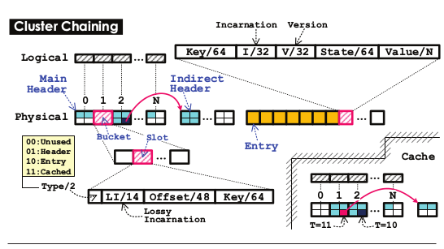
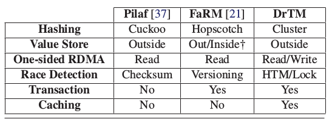

# 论文背景
+ 数据库领域
    + 内存数据库的兴起
    + 传统事务为实现ACID的代价(Logging/Locking/...)
    + 分布式事务的梦魇(分布式锁要比本地锁慢好几个数量级, 加锁时间越长, 并发程度越低, 延迟越高)
+ 硬件领域
    + HTM: 在硬件层面提供了 **原子性** 支持(ACI, 注意没有D)
        + 限制
            + HTM内不能有IO
            + HTM不保证一定成功, 需要fallback
    + RDMA: 提供了 **强一致性** 的远程访问支持
        + 注意, 这里的一致性是内存层面的一致性, 当作Coherence来理解
        + 强一致性即: read last write
        + 三种接口
            + 模拟TCP/IP: ~100us
            + recv/send: ~7us
            + **单向访问**: 最快, ~3us级(原生TCP/IP大约是500us)
                + RDMA CAS有多种级别. 在论文所有的机器上, RDMA CAS与Local CAS **不兼容**

# 论文实现
论文实现了一个 **分布式** **内存数据库**.

论文实现可以分成两层:

+ 事务层: 处理事务, 所有并发控制在这一层做
+ 存储层: 处理存储, 不考虑并发控制, 从而使得逻辑更加清晰, 并且实现更加简洁

## 事务层
基本思想是做HTM(本地)+Locking(远程)来实现事务(ACI), D由Logging + UPS(断电时将内存刷回持久化存储)来保证.

+ 使用Transaction Chopping的技术将大的事务切分为小事务, 保证能够在HTM内执行
+ 读写事务与只读事务的分别对待
    + 由于只读事务通常需要读取很多内容, 容易造成HTM失效, 因此, DrTM将两者区别对待
+ 分布式事务的处理
    + 思路: 将远程机器上的内存读到本地来, 从而转化为单机事务(用HTM解决)
+ HTM失效时Fallback的处理

### 锁
当事务在同一台机器上, HTM可能保证Serializability, 但如果是在多台机器上, 就需要用锁来保证(2PL可以提供Serializability).

+ 写锁: 保证唯一访问
+ 读锁: 基本Lease的共享锁
    + Synchroinzed Time提供分布式的时间服务
    + 验证锁是否Expired: now > lease_end_time + DELTA
    + 验证锁是否可用: now < lease_end_time - DELTA
    + \(..., lease_end_time - DELTA\): 当前时间在此范围内, 表示仍然持有读锁
    + \[lease_end_time - DELTA, lease_end_time + DELTA\], 此为误差范围, 必须避开它
    + \(lease_end_time + DELTA, ...\): 当前时间在此范围内, 表示已经过期
+ 实现: RDMA CAS

### 只读事务
+ 不使用HTM: 因为读的东西一般很多, 时间太长, 容易abort
+ 需要使用 **CAS** 来加锁. 本地CAS与RDMA CAS冲突, 因此, 统一使用RDMA CAS
+ 只读事务的并发控制
    + 本地/本地: 由锁控制
    + 本地/远程: 由锁控制
    + 远程/本地: 由锁控制

### 读写事务
+ 思路:
    + 对于read_set与write_set, 判断是否在都在本地, 如果不是, 则有RDMA加锁并读取(加锁之后, 其他事务就无法访问它们了)
        + end-time = minimum(endtime of lock(x) for x in read_set): 取最小的lease time
    + 涉及到的数据都到了本地后, 使用HTM进行事务处理
    + 事务提交前, 检查now < end-time - DELTA, 如果为真, 说明所有的读锁都没有过期, 事务可以提交, 否则abort
    + 事务提交后, 将write_set加的数据写回, 并释放写锁, 读锁会自动过期
+ 读写事务冲突检测:
    + 先本地/再本地: 由HTM保证原子性
    + 先本地/再远程: 远程的RDMA请求, 会打断当前机器的HTM. 当前事务, 只能等待远程RDMA加的写锁释放后再继续进行. 如果远程RDMA加的是读锁, 则本地HTM可以同时执行
    + 先远程/再本地: 远程的RDMA会先加锁数据, 本地HTM要去访问时, 如果发现数据上有写锁, 则abort, 如果有读锁, 则可并行执行
    + 先远程/再远程: 远程的RDMA会先加锁数据, 另一个远程RDMA来访问时, 如果发现已经有写锁, 则中止, 如果发现是读锁, 则取其中止时间为自己锁的中止时间, 然后正常执行
+ Fallback实现
    + HTM不保证一定可以成功, 即使没有冲突, 因此, 需要一个fallback(基于锁)
    + 步骤
        + 放锁
        + 对所有锁排序后重新加锁, 以避免死锁
        + 执行操作
        + 放锁
        + 写回
    + 注意: 以上操作需要记Log, 以应对错误情况

### 重点强调
+ 冲突检测
    + 对于同样使用了HTM的两个事务, HTM保证它们的before-or-after
    + 对于一个已经存在的HTM事务(读ab, 写cd), 如果另一个远程事务需要访问abcd, 则需要先用RDMA加锁, 并把数据读回来, 加锁过程会abort已有的HTM事务, 从而后面的这个远程事务会先发生. 之前的HTM事务需要重试
    + 对于两个远程事务, 锁会保证其先后
    + 所有只读事务都当作远程事务来处理(使用加锁来保证顺序)
+ HTM + 读写锁机制等价于2PL, 从而, 可以保证Serializability
    + 具体证明见4.4, **一定要读**

## 存储层
+ DrTM提供了两类存储
    + 有序存储: 基于B+ Tree, 没有充分利用RDMA的特性
    + 无序存储: 基于Hash, 充分利用了RDMA的特性, 并且, 在事务层的保护下, 不需要考虑冲突检测问题
+ 无序存储实现
    + 
    + 记住这张图! 记住这张图! 记住这张图!
    + 这张图配着5.2节看更有味道哦
+ 有序存储实现
    + 只需要知道它没有充分利用RDMA特性, 是个future work就是了
+ 其他: 论文中比较了DrTM与其他另外两个平台的Hash实现(但是比较过程中涉及了许多知识点, 要是真考这个, 大家洗好脖子吧), DrTM的优点大概是
    + 分离了存储操作与冲突检测
    + 之前的实现偏向于RDMA(而不是Local), 增加了延迟
    + 本地内存操作还是比RDMA快, 但是之前的实现没有考虑本地缓存
    + 

## 缺点
+ 事务需要事先知道write-set与read-set
+ 无序存储是HTM/RDMA友好的, 而有序存储则没有对RDMA做过优化
+ 当有机器失效时, 考虑Durability而不是可用性
    + 读写事务提交后, 需要写回, 并释放写锁, 如果此时, 此机器挂了, 其锁永远无法被释放

## 其他实现细节
+ Synchroinzed Time
    + 理想情况是使用TrueTime API(From Spanner)
    + 论文中使用的是PTP
    + 每个Node上, 一个timer thread会周期性同步software time, 其他线程直接用
+ Fallback Handler是如何保证Serializability的
+ RDMA CAS与Local CAS的不兼容(RDMA CAS分成很多级别, 某些级别是兼容的, 但是论文所用的硬件不支持)

# 课后习题
+ How does DrTM detect conflicts between remote reads and local writes?
    + Local writes会被包裹在HTM中. 远程reads使用的RDMA会打断本地HTM, 从而避免了冲突
+ Why DrTM has the deadlock issue and how does it avoid the deadlock?
    + 在fallback handler中会出现, 详见上文事务层中fallback实现
+ What’s the limitation of DrTM?
    + 见上文
